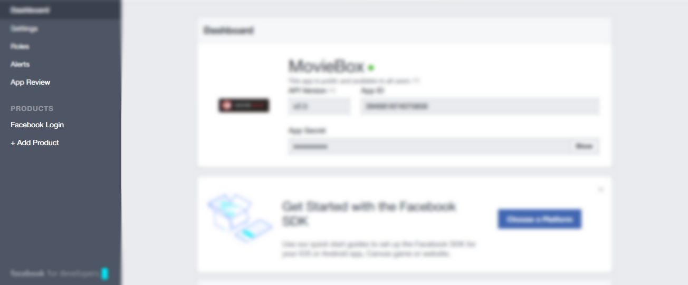
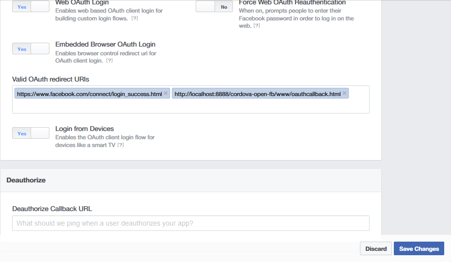

# OpenFB Cordova InAppBrowser Facebook Plugin

This plugin has no dependency: You don't need (and shouldn't use) the Facebook SDK with this library.

OpenFB allows you to login to Facebook and execute any Facebook Graph API request.

## Supported Platforms

- Android
- iOS

### Installation

This requires phonegap/cordova CLI 3.0+

- Cordova CLI

```sh
cordova plugin add https://github.com/whebcraft/openfb
```


- Phonegap Build

```sh
    <plugin spec="https://github.com/whebcraft/openfb.git" source="git" />
```

### Getting Started

To Test Facebook login sample on your own system:

- Create a Facebook app [here][fb_apps], in the app sidebar under > PRODUCTS click on FACEBOOK LOGIN.
</img>

- on FACEBOOK LOGIN page scrool down enter https://www.facebook.com/connect/login_success.html  and  http://localhost:8888/cordova-open-fb/www/oauthcallback.html as Valid OAuth redirect URIs - [Required]
</img>


 For example, if during development you access your application from `http://localhost/YOUR-APP/www/index.html` (If testing from localhost) you must declare `http://localhost/YOUR-APP/www/index.html` as a valid redirect URI.

[fb_apps]: https://developers.facebook.com/apps

### Quick Example
```js

// Int
openFB.init({appId: 'YOUR_FACEBOOK_APP_ID'});


// Facebook Login
openFB.login(
   function(res) {
        if (res.status === 'connected') {
		// Login Successfull...
         getUsersData();
        } else {
	     // Cancelled by the user.
            alert('Login With Facebook Cancelled');
        }
    }, {
        scope: 'email'
});

// Get user data after user is logged in
function getUsersData(){
openFB.api({
    path: '/me',
    success: function(f) {
    // f is an object
    },
    error: function(e) {
        alert(e.message);
    }
});
}
